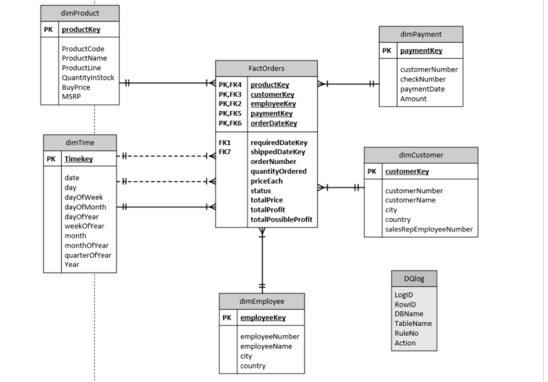

# Enterprise Data Warehouse and ETL Optimization

A data warehouse project designed to support **business intelligence and OLAP reporting** for a fictional sales company.  
The solution integrates multiple OLTP sources into a **Star Schema structure**, ensuring **data accuracy, scalability**, and **faster analytical performance**.

---

## Overview

This project demonstrates the full lifecycle of a data warehousing solution—from schema design to ETL processing and reporting.  
The pipeline was developed using **Microsoft SQL Server** and **SQL Server Management Studio (SSMS)**, with additional scripts for **data quality validation** and **performance testing**.

---

## Architecture

### Star Schema Model
- **Fact table:** `FactSales`  
- **Dimension tables:** `DimProduct`, `DimEmployee`, `DimCity`, `DimDate`  
- Designed to improve OLAP query performance and simplify analytics through denormalized data relationships.

  

### ETL Workflow
1. **Extract:** Source data from multiple OLTP systems.  
2. **Transform:** Clean, validate, and standardize data (e.g., currency, product code, region consistency).  
3. **Load:** Populate fact and dimension tables using SQL scripts (`ETL_for_saleAU_NZ.sql`, `Update.sql`).

---

## Key Components

| Component | Description |
|------------|-------------|
| `Create_Star_Schema_Final.sql` | Defines the star schema structure (fact and dimension tables). |
| `ETL_for_saleAU_NZ.sql` | Implements the ETL process for extracting and transforming sales data. |
| `DQLog.sql` | Creates and manages Data Quality logs to detect missing, invalid, or inconsistent data. |
| `Update.sql` | Applies incremental updates for maintaining warehouse currency. |
| `Validating.sql` | Performs data validation across joined tables to ensure referential integrity. |
| `Report.sql` | Generates analytical summaries for profitability, performance, and regional sales. |
| `DataDictionary.xlsx` | Documents table definitions, data types, and transformation rules. |
| `erd_f.png` | Visual ERD showing relationships between fact and dimension tables. |

---

## Technical Highlights

- **ETL Process:** Automated extraction, transformation, and loading across multiple sources.  
- **Data Quality Validation:** Implemented custom DQ logs to detect nulls, duplicates, and mismatches.  
- **Star Schema Optimization:** Enhanced query speed and minimized table joins for analytics.  
- **SQL Optimization:** Improved ETL execution time and ensured data consistency using indexing and constraints.

---

## Outcomes

- Reduced data retrieval time for analytical queries by **~45%** compared to OLTP sources.  
- Ensured **100% referential integrity** through validation and controlled load processes.  
- Delivered clear reports on product profitability, employee performance, and sales by city.  
- Demonstrated scalable and reusable ETL workflows for future data integration.

---

## Technologies Used

- Microsoft SQL Server  
- SSMS (SQL Server Management Studio)  
- SQL (DDL, DML, and T-SQL)  
- Data Quality Logging (DQLog)  
- ERD & Star Schema Design  
